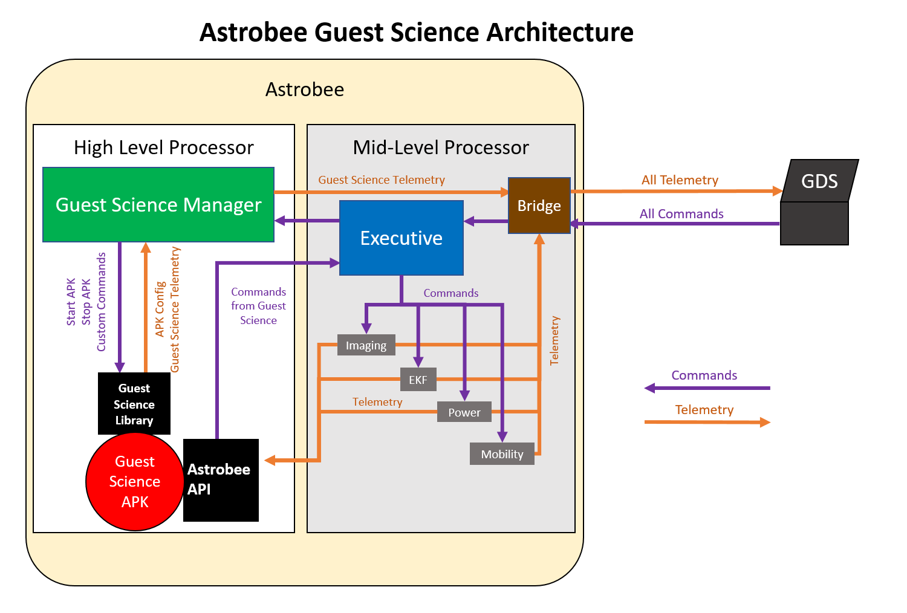

# Guest Science Information

## Astrobee Guest Science Architecture



Guest Science (GS) on Astrobee consists of APKs (written in Java) that run on
the High Level Processor (HLP). The majority of Astrobee Flight Software is
written in C++, uses ROS, and runs on the Low-Level Processor (LLP) and
Mid-Level Processor (MLP). Please note, in simulation the LLP and MLP are
technically the same thing. As you continue with this section, please refer to
the Astrobee Guest Science Architecture diagram for further understanding.

### Astrobee Communications and Commanding Architecture

Astrobee operates by accepting commands from either a ground controller or a
GS APK.

#### Ground Controllers 

For understanding, we will explain how ground controllers command Astrobee. All
ground controllers use the Astrobee Control Station (also called GDS for Ground
Data System), which is written in Java and communicates with Astrobee through
DDS. All communication from GDS goes through DDS to the ROS Bridge before being
passed to the Executive. The Executive sends commands to various subsystems on
Astrobee, waits for the commands to finish, and returns an acknowledgment
message which is translated from ROS to DDS in the Bridge and sent to GDS.
Individual subsystems report telemetry, which like the ack, goes through the ROS
Bridge to DDS which then goes to GDS.

#### Guest Science APKs

As mentioned previously, GS APKs run on the HLP. Because of this, they don't
have to use DDS to communicate with the flight software. They can communicate
directly with the Executive and listen to subsystem telemetry using ROS topics
and messages. To make guest science development easier, the Astrobee API library
was created to handle the ROS communication layer.

### Guest Science Manager

Guest Science APKs are installed on the HLP. When Astrobee starts up, GS APKs
are not started. This is because there will be many GS APKs installed on the HLP
and starting them all at the same time would be a disaster. Thus the Guest
Science Manager (GSM) was created in order to manage the lifecycle of a GS APK.
Astrobee offers a start guest science and a stop guest science command. The GSM
starts and stops GS APKs based on these commands which are issued by a ground
controller.

Astrobee also offers a custom guest science command. This command allows guest
scientists to command their GS APKs. The command itself is just an APK name and
a string. The GSM uses the APKs name to route the string to the right APK. The
string in this case is the command for the GS APK and it can be any type of
string (json, html, your own made up language, etc..). Moreover, the GSM relays
telemetry from GS APKs to the ROS Bridge which is then translated to DDS and
displayed in GDS. A helper library, the Guest Science Library, has been created
to facilitate communication between the GSM and a GS APK.

## Data directories

Guest Science Applications can generate data that will be stored on the Android
HLP SD card (total size is 64GB, shared with other applications).

The data produced during an experiment can be made available either for:
  - immediate download
  - delayed download

Immediate versus delayed download depends of the amount of data to transfer and
of the payload agreement with ISS.

In addition, Guest Science may need to upload files to Astrobee (in case the
data cannot fit into a generic message). These incoming files will also go
in a specific directory.

### Immediate download

The files scheduled for immediate download are transferred from Astrobee to the
Ground just after the experiment using DTN over Trek.

### Delayed download

The files scheduled for delayed download are copied to the ISS NAS. The NAS
is synched to the ground at ISS convenience.

### Incoming files

Incoming files will be manually copied by the engineering team to Astrobee to
a specific location on the HLP.

### Directory structure

```
/sdcard/data/PAYLOAD/
                    immediate/DATE
                    delayed/DATE
                    incoming
```

  - `PAYLOAD` is the Java package name of the Guest Science application.
  - `DATE` is recommended (but not enforced) and follow the scheme:
    - `YYYY-MM-DD`

Currently the `/sdcard/data/PAYLOAD/` path is passed to the Guest Science
Application by the Guest Science Manager using an Android messenger. The Guest
Science Library includes a function that the Guest Science Application can used
to get this path.


**For more information on the Guest Science Library and the Astrobee API, please
see the [Guest Science Developer Guide](gs_developer_guide.md).**
